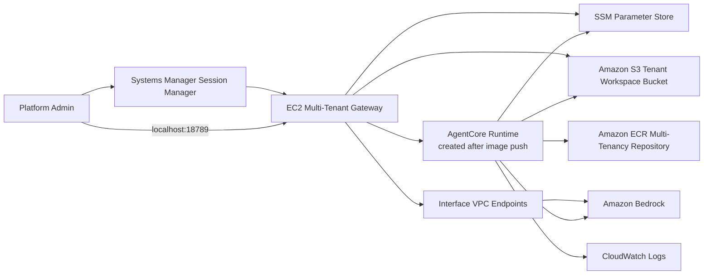
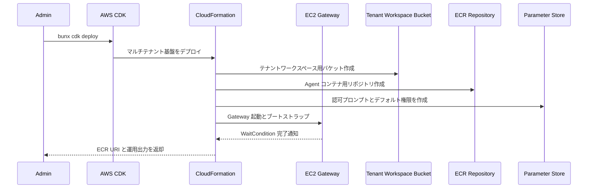
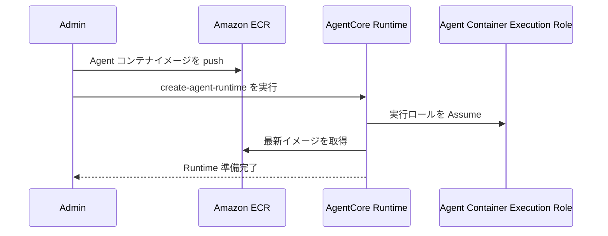
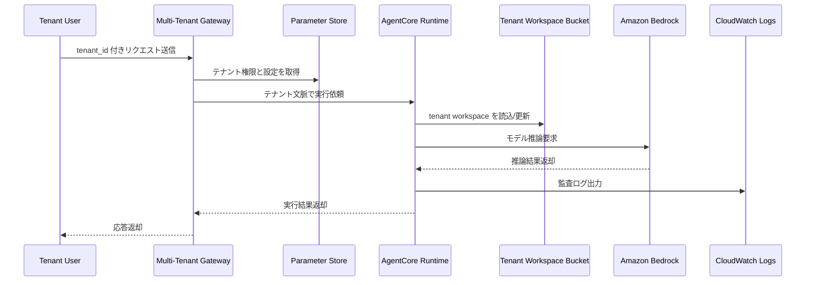
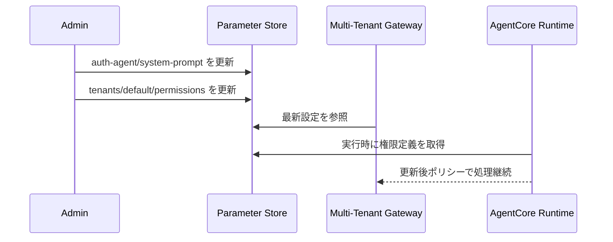

# OpenClaw Bedrock AgentCore Multitenancy CDK Stack

## 概要

このスタックは、OpenClaw のマルチテナント基盤を構築するためのインフラスタックです。EC2 Gateway に加え、テナントごとのワークスペース保存先 S3 バケット、Agent コンテナ保管用 ECR リポジトリ、認可プロンプトやデフォルト権限を保持する SSM Parameter Store、運用ログ用 CloudWatch Logs をまとめて作成します。

特徴は、AgentCore Runtime そのものはこのスタックでは作らず、コンテナイメージを ECR に push した後に別手順で作成する点です。つまり、このスタックはマルチテナント運用のベースインフラを用意し、ランタイム生成は後段に分離しています。

## 機能一覧

| 機能 | 説明 | 実装ポイント |
| --- | --- | --- |
| マルチテナント Gateway | EC2 上の Gateway で複数テナントからの要求を受け付ける | Session Manager ベースで管理アクセス |
| テナントワークスペース保管 | S3 にテナントごとの状態やスキル資産を保存 | バージョニング有効、古い版は 30 日で整理 |
| Agent コンテナ配布 | AgentCore 用コンテナイメージの格納先を作成 | ECR リポジトリを本スタックで作成 |
| 認可ポリシー外部化 | Authorization Agent のシステムプロンプトとデフォルト権限を SSM に保存 | 再デプロイなしで更新可能 |
| 監査ログ集約 | エージェント実行ログの出力先を CloudWatch Logs に集約 | テナント単位のストリーム運用を前提 |
| AgentCore 実行ロール | 後続で作成する AgentCore Runtime が必要とする権限を付与 | ECR、Bedrock、S3、SSM、CloudWatch を利用可能 |
| VPC Endpoint による閉域接続 | Gateway から Bedrock/SSM へのプライベート接続を提供 | `CreateVPCEndpoints=true` 時のみ作成 |

## 採用 AWS サービス

| AWS サービス | このスタックでの役割 |
| --- | --- |
| AWS CDK / AWS CloudFormation | マルチテナント基盤の一括デプロイ |
| Amazon EC2 | OpenClaw Gateway を実行 |
| Amazon VPC | Gateway とエンドポイントのネットワークを提供 |
| Amazon S3 | テナントワークスペース、プロンプト補助資産の保存先 |
| Amazon Elastic Container Registry | マルチテナント Agent コンテナのイメージ保管先 |
| AWS Identity and Access Management | EC2 ロールと AgentCore 実行ロールを提供 |
| AWS Systems Manager Parameter Store | 認可エージェント用プロンプトとデフォルト権限を保存 |
| Amazon CloudWatch Logs | エージェント実行ログを保管 |
| Amazon Bedrock | Agent Container からの推論実行先 |
| Amazon Bedrock AgentCore | 後続手順で接続されるサーバレス実行基盤 |
| Amazon VPC Endpoint | Bedrock/SSM 向けのプライベート接続 |

## システム構成図



## 機能別シーケンス図

### 1. 基盤デプロイ



### 2. Agent コンテナ公開と Runtime 接続



### 3. テナント要求処理



### 4. 権限承認プロンプト更新



## 主要パラメータ

| パラメータ | 用途 |
| --- | --- |
| `OpenClawModel` | Gateway 側の既定モデル |
| `InstanceType` | Gateway EC2 インスタンスタイプ |
| `MaxConcurrentTenants` | 同時処理するテナント数の目安 |
| `BedrockModelId` | Agent Container 側で利用するモデル ID |
| `EnableAgentCoreMemory` | メモリ永続化レイヤーの利用前提フラグ |
| `AuthAgentChannelType` | Human Approver への通知チャネル |
| `CreateVPCEndpoints` | 閉域接続を構成するか |

## よく使うコマンド

```bash
bun install
bun run build
bun run test
bunx cdk synth
bunx cdk diff
bunx cdk deploy
```

## 補足

- AgentCore Runtime は別手順で作成するため、スタック完了後すぐにサーバレス実行が有効になるわけではありません。
- S3 バケットはマルチテナント状態管理の中核であり、テナント単位のプレフィックス設計とライフサイクル設計が運用上重要です。
- SSM Parameter Store に置いた認可設定は、インフラ再作成なしで変更できる点がこの構成の運用上の利点です。
