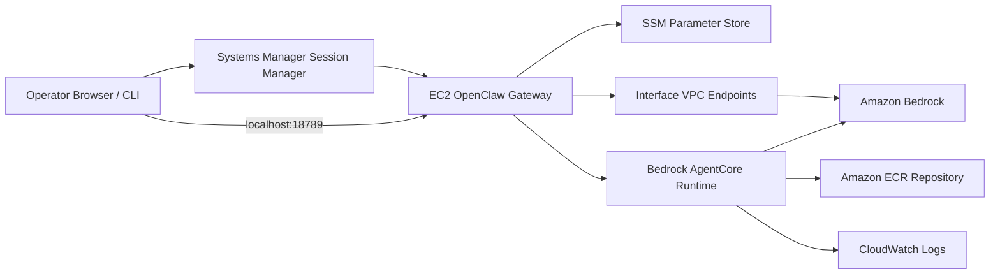
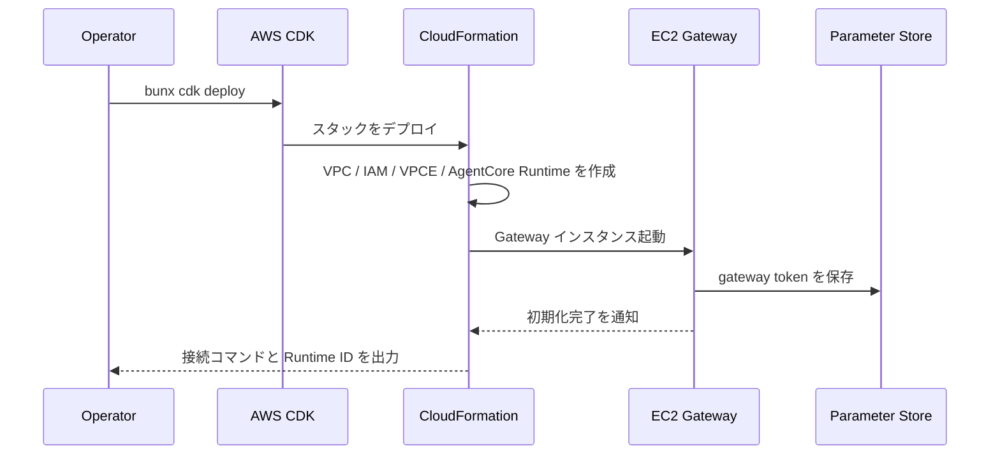
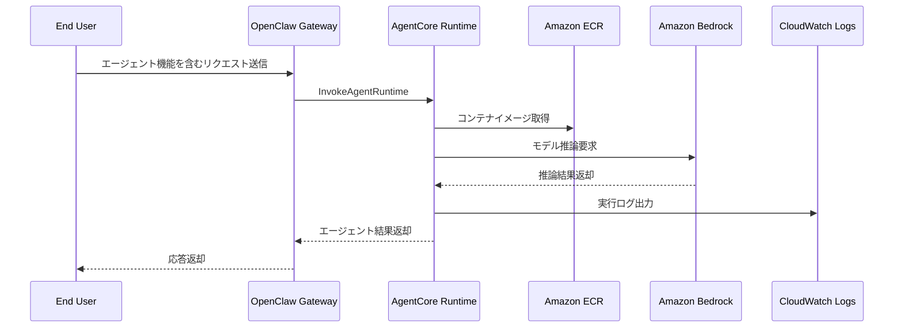
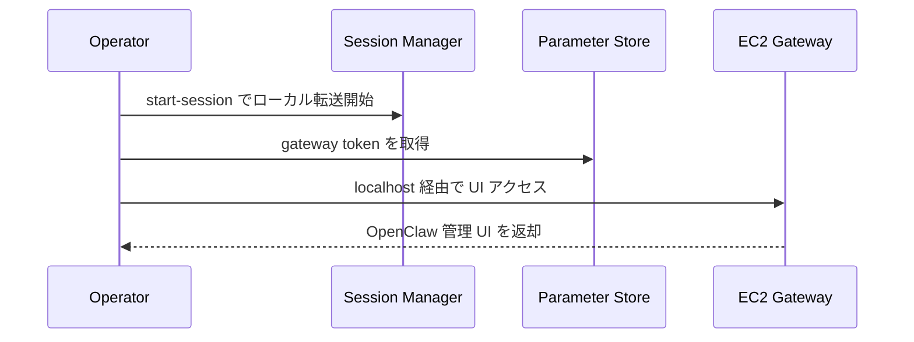
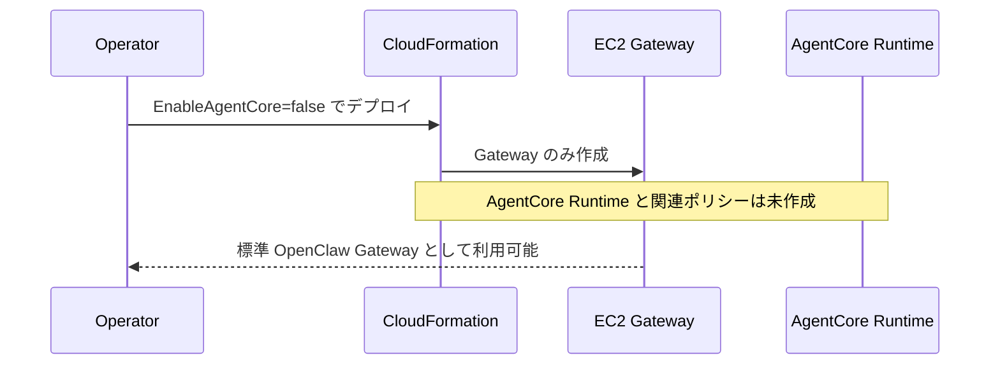

# OpenClaw Bedrock AgentCore CDK Stack

## 概要

このスタックは、OpenClaw の Gateway を EC2 上に配置しつつ、Bedrock AgentCore Runtime を併用する構成をデプロイします。標準 Bedrock スタックに加えて、AgentCore 実行用 IAM ロールと `AWS::BedrockAgentCore::Runtime` を作成し、Agent コンテナをサーバレス実行できるようにします。

Gateway は従来どおり Session Manager 経由で利用し、AgentCore Runtime は ECR 上のコンテナイメージを参照して起動します。なお、このスタックは AgentCore Runtime の参照先 URI は出力しますが、ECR リポジトリ自体は作成しません。

## 機能一覧

| 機能 | 説明 | 実装ポイント |
| --- | --- | --- |
| Gateway + AgentCore 併用構成 | EC2 Gateway と AgentCore Runtime を同時に展開 | ブラウザ経由の Gateway とサーバレス Agent を役割分離 |
| AgentCore Runtime 作成 | Bedrock AgentCore Runtime を CloudFormation 管理下で作成 | `EnableAgentCore=true` の場合のみ作成 |
| AgentCore 実行ロール | AgentCore が ECR、CloudWatch Logs、Bedrock を使う権限を付与 | `bedrock-agentcore.amazonaws.com` を信頼主体に設定 |
| ECR 連携前提の出力 | コンテナ URI と関連権限を出力 | リポジトリ URI は固定命名、別途イメージ準備が必要 |
| SSM ベース運用 | Gateway への接続は Session Manager を前提 | SSH は任意のフォールバック |
| VPC Endpoint による私設接続 | Bedrock Runtime と SSM 系エンドポイントを作成 | `CreateVPCEndpoints=true` で有効 |

## 採用 AWS サービス

| AWS サービス | このスタックでの役割 |
| --- | --- |
| AWS CDK / AWS CloudFormation | インフラ定義とデプロイ制御 |
| Amazon EC2 | OpenClaw Gateway を実行 |
| Amazon VPC | Gateway と VPC Endpoint の配置先ネットワーク |
| AWS Identity and Access Management | EC2 用ロールと AgentCore 実行ロールを提供 |
| AWS Systems Manager | Session Manager と Parameter Store に利用 |
| Amazon Bedrock | OpenClaw のモデル推論先 |
| Amazon Bedrock AgentCore | Agent コンテナのサーバレス実行基盤 |
| Amazon Elastic Container Registry | AgentCore Runtime が参照するコンテナイメージ保管先 |
| Amazon CloudWatch Logs | AgentCore 実行ログの出力先 |
| Amazon VPC Endpoint | Bedrock/SSM へのプライベート接続 |

## システム構成図



## 機能別シーケンス図

### 1. デプロイと Gateway 準備



### 2. AgentCore Runtime 呼び出し



### 3. 管理者の Gateway アクセス



### 4. AgentCore 無効時の動作分岐



## 主要パラメータ

| パラメータ | 用途 |
| --- | --- |
| `OpenClawModel` | Gateway 側で利用する Bedrock モデル |
| `InstanceType` | EC2 Gateway のインスタンスタイプ |
| `CreateVPCEndpoints` | Bedrock/SSM のプライベート接続有無 |
| `EnableAgentCore` | AgentCore Runtime を作成するか |
| `AllowedSSHCIDR` | フォールバック SSH の許可範囲 |
| `KeyPairName` | 緊急時の SSH 用キーペア |

## よく使うコマンド

```bash
bun install
bun run build
bun run test
bunx cdk synth
bunx cdk diff
bunx cdk deploy
```

## 補足

- ECR リポジトリはこのスタックで明示作成していないため、AgentCore 用コンテナ配布手順は運用側で整備する前提です。
- AgentCore Runtime は `NetworkMode: PUBLIC` で作成されます。
- Gateway と AgentCore を分離することで、対話 UI とエージェント実行基盤を別スケールで扱えます。
