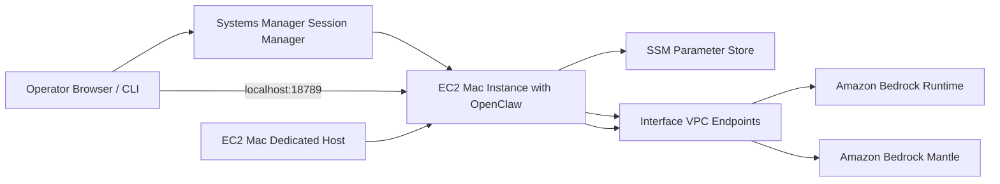
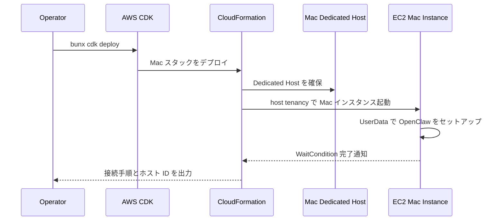
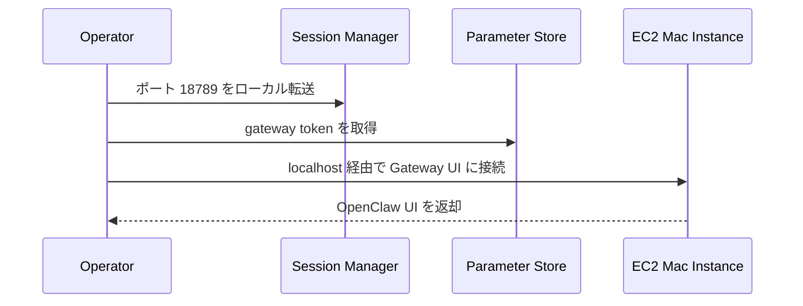
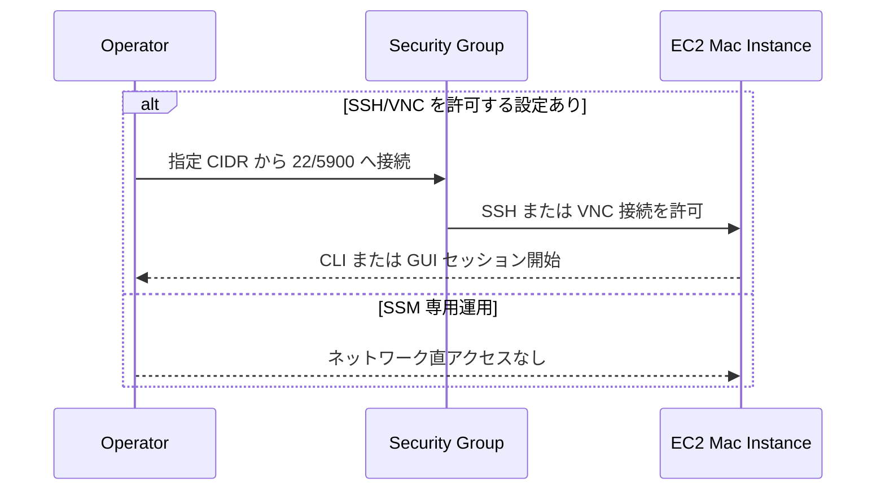
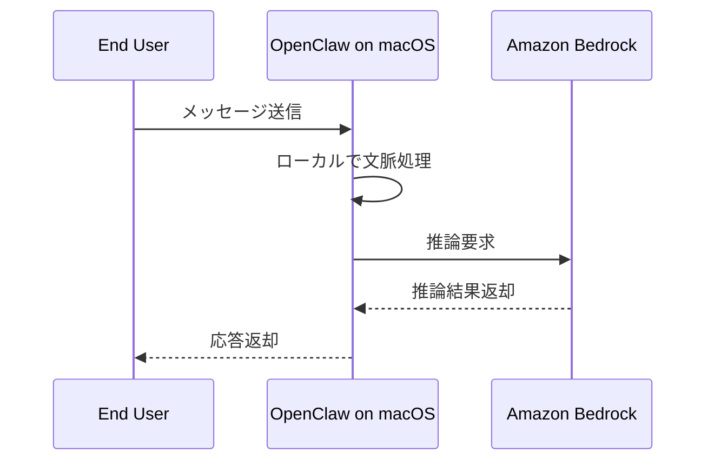

# OpenClaw Bedrock Mac CDK Stack

## 概要

このスタックは、OpenClaw を EC2 Mac インスタンス上にデプロイするための構成です。Mac Dedicated Host、Mac EC2、VPC、IAM、VPC Endpoint をまとめて作成し、macOS 上で OpenClaw を起動します。Apple Silicon と Intel の両方をサポートし、リージョン別 AMI マッピングまたはカスタム AMI を利用できます。

Linux ベースの標準スタックと比較すると、Mac 固有の Dedicated Host 制約、24 時間の最小割当、VNC を使った GUI アクセスの考慮が追加されています。

## 機能一覧

| 機能 | 説明 | 実装ポイント |
| --- | --- | --- |
| EC2 Mac デプロイ | Mac インスタンス上で OpenClaw を起動 | `tenancy: host` と Dedicated Host を使用 |
| Dedicated Host 自動作成 | Mac インスタンスに必須のホストを確保 | `MacAvailabilityZone` を指定して作成 |
| Apple Silicon / Intel 対応 | `mac1.metal` と `mac2*` 系をサポート | インスタンスタイプごとに AMI を切替 |
| リージョン別 AMI マッピング | よく使うリージョンでは既定 AMI を自動選択 | `MacAmiId=auto` のときに利用 |
| Bedrock 私設接続 | Bedrock Runtime と条件付き Mantle を VPC Endpoint 経由で接続 | `CreateVPCEndpoints=true` のときのみ作成 |
| SSM 主体の運用 | Gateway 接続は Session Manager を前提 | 必要時のみ SSH/VNC を許可 |
| GUI 操作用ポート | 5900/TCP の VNC 開放を条件付きで設定 | `AllowedSSHCIDR` と `KeyPairName` が必要 |

## 採用 AWS サービス

| AWS サービス | このスタックでの役割 |
| --- | --- |
| AWS CDK / AWS CloudFormation | インフラ定義とデプロイ |
| Amazon EC2 Dedicated Host | Mac インスタンス配置用ホスト |
| Amazon EC2 Mac Instance | macOS 上で OpenClaw を実行 |
| Amazon VPC | ネットワーク基盤 |
| AWS Identity and Access Management | EC2 用インスタンスロールを提供 |
| AWS Systems Manager | Session Manager と Parameter Store に使用 |
| Amazon Bedrock | OpenClaw の推論先 |
| Amazon VPC Endpoint | Bedrock/SSM/Mantle へのプライベート接続 |
| Amazon EBS | 100GB のルートボリュームを提供 |

## システム構成図



## 機能別シーケンス図

### 1. Dedicated Host を含む初回構築



### 2. 管理アクセス



### 3. GUI 操作が必要な場合の分岐



### 4. Bedrock 推論フロー



## 主要パラメータ

| パラメータ | 用途 |
| --- | --- |
| `OpenClawModel` | 利用する Bedrock モデル |
| `MacInstanceType` | Mac インスタンスタイプ |
| `MacAvailabilityZone` | Dedicated Host を配置する AZ |
| `MacAmiId` | カスタム AMI または自動 AMI 選択 |
| `CreateVPCEndpoints` | Bedrock/SSM/Mantle の VPCE を作成するか |
| `AllowedSSHCIDR` | SSH/VNC の許可範囲 |
| `KeyPairName` | SSH フォールバック用キーペア |

## よく使うコマンド

```bash
bun install
bun run build
bun run test
bunx cdk synth
bunx cdk diff
bunx cdk deploy
```

## 補足

- Mac インスタンスは Dedicated Host の 24 時間最小割当があるため、短時間検証でもコスト影響が大きいです。
- `MacAmiId=auto` を使う場合は、スタックに埋め込まれたリージョンマッピングに依存します。
- Apple Silicon 系の `mac2*` は多くの用途で価格性能比に優れます。
