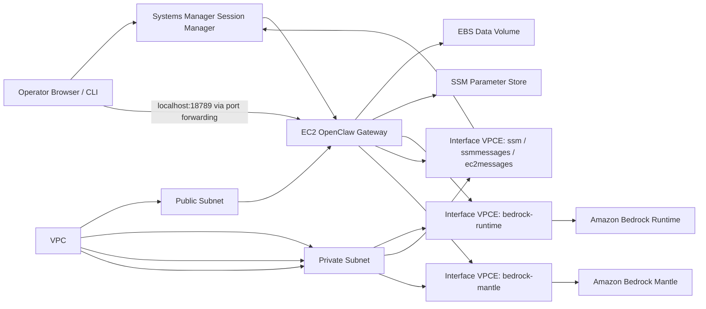
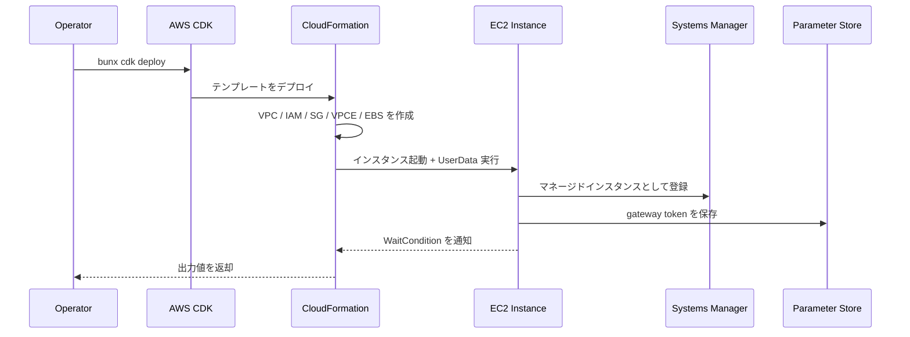
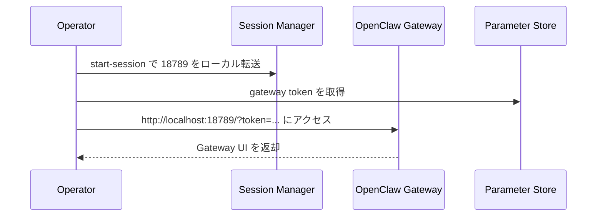
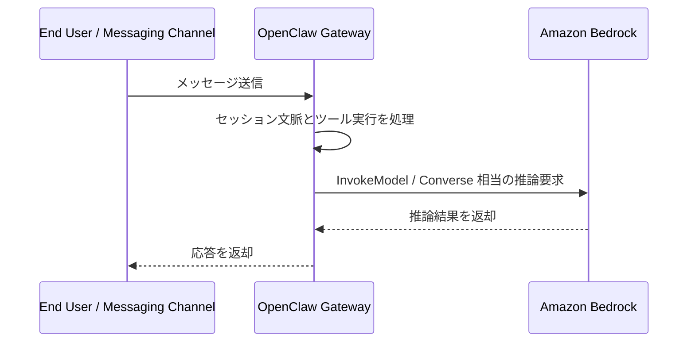
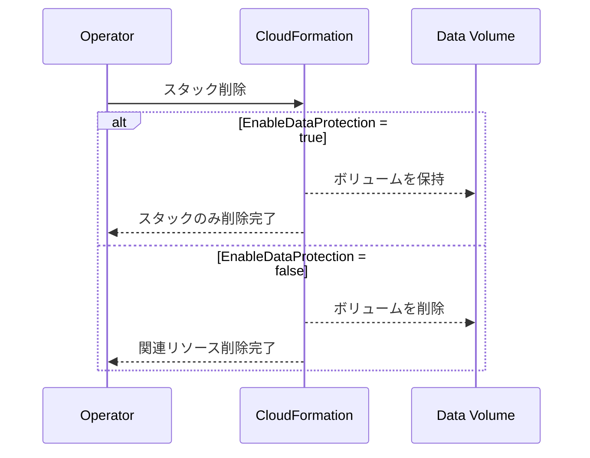

# OpenClaw Bedrock CDK Stack

## 概要

このスタックは、OpenClaw を単一 EC2 インスタンス上にデプロイするための標準構成です。CDK から CloudFormation テンプレートを生成し、VPC、サブネット、EC2、IAM、VPC エンドポイント、EBS データボリュームをまとめて作成します。OpenClaw のセットアップは UserData で自動実行され、デプロイ後は Systems Manager のポートフォワーディング経由で Gateway UI にアクセスします。

主な用途は、Bedrock を使った OpenClaw のシングルテナント運用、検証環境、PoC、社内利用向けの小規模構成です。

## 機能一覧

| 機能 | 説明 | 実装ポイント |
| --- | --- | --- |
| OpenClaw 単体デプロイ | Ubuntu 24.04 ベースの EC2 に OpenClaw を自動構築 | UserData で AWS CLI、SSM Agent、Docker、Node.js、OpenClaw を導入 |
| ネットワーク自動作成 | 専用 VPC、パブリック/プライベートサブネット、IGW、ルートを作成 | Gateway はパブリックサブネット、VPC エンドポイントはプライベートサブネット |
| Bedrock 私設接続 | Bedrock Runtime と条件付き Bedrock Mantle の Interface VPC Endpoint を作成 | `CreateVPCEndpoints=true` のときのみ作成 |
| 管理アクセス最小化 | 通常運用は SSM Session Manager を前提にし、SSH は任意 | `AllowedSSHCIDR` と `KeyPairName` が揃った場合のみ 22 番を許可 |
| データ保護 | OpenClaw 用の追加 EBS ボリュームをアタッチ | `EnableDataProtection=true` の場合は削除時も保持 |
| サンドボックス実行 | Docker を利用した隔離実行を有効化可能 | `EnableSandbox=true` でインストール |
| ARM/x86 自動切替 | インスタンスタイプに応じて Ubuntu AMI のアーキテクチャを切替 | SSM public parameter で最新 AMI を解決 |

## 採用 AWS サービス

| AWS サービス | このスタックでの役割 |
| --- | --- |
| AWS CDK / AWS CloudFormation | インフラ定義、デプロイ、出力値の生成 |
| Amazon VPC | OpenClaw 用の専用ネットワークを提供 |
| Amazon EC2 | OpenClaw Gateway 本体を実行 |
| Amazon EBS | ルートボリュームと追加データボリュームを提供 |
| AWS Identity and Access Management | EC2 インスタンスロールとインスタンスプロファイルを提供 |
| AWS Systems Manager | Session Manager による接続と Parameter Store のトークン保管に使用 |
| Amazon Bedrock | OpenClaw の推論実行先 |
| Amazon VPC Endpoint | Bedrock と SSM へのプライベート接続を提供 |
| Amazon CloudWatch | CloudWatch Agent ポリシー経由でメトリクス/ログ送信を許可 |

## システム構成図



## 機能別シーケンス図

### 1. 初回デプロイとブートストラップ



### 2. 管理者アクセスと Gateway 利用



### 3. OpenClaw の推論実行



### 4. データ保護付き削除フロー



## 主要パラメータ

| パラメータ | 用途 |
| --- | --- |
| `OpenClawModel` | 利用する Bedrock モデル ID |
| `InstanceType` | EC2 インスタンスタイプ |
| `CreateVPCEndpoints` | Bedrock/SSM 用 VPC エンドポイントを作成するか |
| `EnableSandbox` | Docker サンドボックスを有効にするか |
| `EnableDataProtection` | 追加 EBS ボリュームを保持するか |
| `AllowedSSHCIDR` | SSH を許可する CIDR |
| `KeyPairName` | 緊急時の SSH 用キーペア |

## よく使うコマンド

```bash
bun install
bun run build
bun run test
bunx cdk synth
bunx cdk diff
bunx cdk deploy --all
bunx cdk destroy
```

## 補足

- Bedrock Mantle の VPC エンドポイントは対応リージョンでのみ作成されます。
- SSH はあくまでフォールバック手段で、通常運用は Session Manager を前提にしています。
- Data volume はルートディスクとは別にアタッチされるため、保持設定を使うと再デプロイ時のデータ再利用設計を組みやすくなります。
