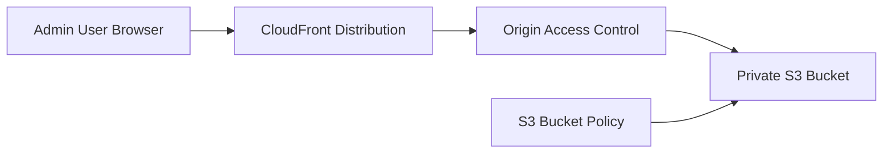
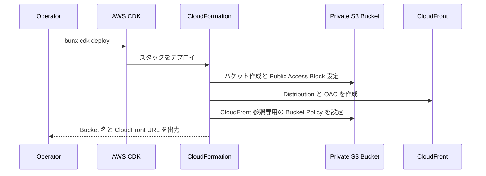
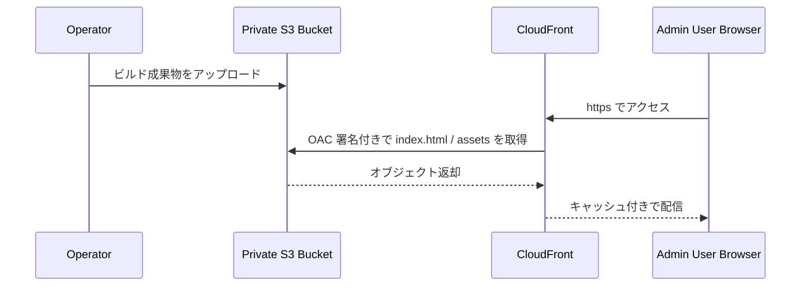
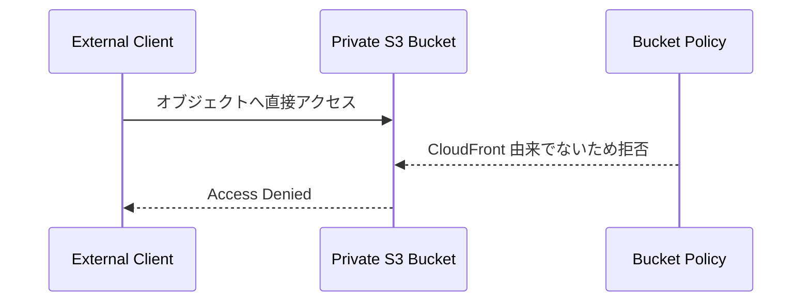

# OpenClaw Admin Console Static Site CDK Stack

## 概要

このスタックは、OpenClaw Admin Console の静的配信基盤を構築します。S3 バケットをプライベートのまま保持し、CloudFront Origin Access Control を使って CloudFront からのみ配信できる構成を作成します。公開エンドポイントは CloudFront 側だけで、S3 への直接公開は行いません。

対象は、管理コンソールの SPA や静的 HTML/JS/CSS 配信です。CI/CD パイプラインやファイル同期処理はこのスタックには含まれておらず、ビルド成果物のアップロードは別手順で実施します。

## 機能一覧

| 機能 | 説明 | 実装ポイント |
| --- | --- | --- |
| プライベート静的ホスティング | S3 を非公開に保ったまま CloudFront 経由で配信 | Public Access Block を全面有効化 |
| OAC ベース保護 | CloudFront OAC による署名付きアクセスのみ許可 | OAI ではなく OAC を採用 |
| HTTPS 配信 | ビューワープロトコルを HTTPS リダイレクト | `redirect-to-https` を設定 |
| SPA 向け既定ルート | `index.html` をデフォルトルートに設定 | `defaultRootObject` を利用 |
| 軽量キャッシュ配信 | 標準キャッシュポリシーで圧縮配信 | `compress=true`, `PriceClass_100` |

## 採用 AWS サービス

| AWS サービス | このスタックでの役割 |
| --- | --- |
| AWS CDK / AWS CloudFormation | ホスティング基盤の定義とデプロイ |
| Amazon S3 | Admin Console の静的アセット保存先 |
| Amazon CloudFront | グローバル配信、HTTPS 化、キャッシュ配信 |
| CloudFront Origin Access Control | CloudFront から S3 への署名付きアクセス制御 |

## システム構成図



## 機能別シーケンス図

### 1. 配信基盤の作成



### 2. 管理画面の公開



### 3. S3 直接アクセスの遮断



## 主要出力値

| 出力値 | 用途 |
| --- | --- |
| `BucketName` | 静的アセットのアップロード先 |
| `CloudFrontURL` | Admin Console の公開 URL |
| `DistributionId` | 無効化や運用確認に使う Distribution ID |

## よく使うコマンド

```bash
bun install
bun run build
bun run test
bunx cdk synth
bunx cdk diff
bunx cdk deploy
```

## 補足

- このスタックにはカスタムドメイン、ACM 証明書、CloudFront invalidation 自動化は含まれていません。
- S3 は非公開のため、運用時は CloudFront 経由でのみ閲覧できます。
- アセット更新時は必要に応じて CloudFront invalidation を別途実行してください。
